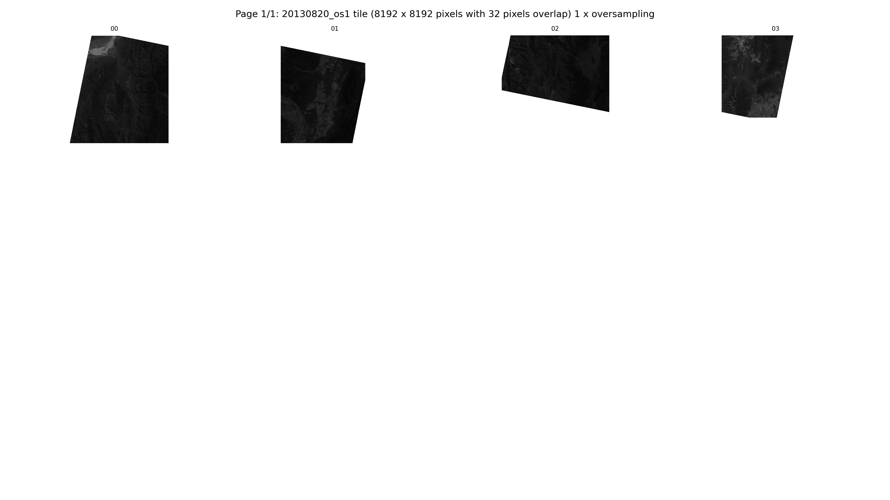
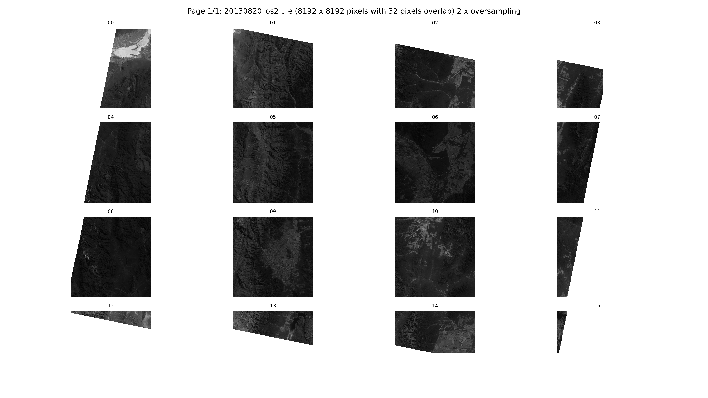

# Setup for running GPU-based block matching with tiles on a slurm queue

Requires the numba-based block matching code [https://github.com/UP-RS-ESP/numba_cuda_block_matching](https://github.com/UP-RS-ESP/numba_cuda_block_matching)

1. **Generating tiles**. Run the initial tile generation on the server where the data are stored. This is important, because there is large file i/o. The oversampling step is slow. It is not possible to run the scipy.ndimage.zoom via cupy [https://docs.cupy.dev/en/latest/reference/generated/cupyx.scipy.ndimage.zoom.html](https://docs.cupy.dev/en/latest/reference/generated/cupyx.scipy.ndimage.zoom.html) because memory will be exceeded for a full Landsat scene.
```bash
mkdir log
python create_Landsat_tiles.py /raid2-gpu2/bodo/Landsat-test 8192 32 1 2>&1 | tee log/create_Landsat_tiles_8192_32_1.log
python create_Landsat_tiles.py /raid2-gpu2/bodo/Landsat-test 8192 48 2 2>&1 | tee log/create_Landsat_tiles_8192_48_1.log
python create_Landsat_tiles.py /raid2-gpu2/bodo/Landsat-test 8192 64 5 2>&1 | tee log/create_Landsat_tiles_8192_64_1.log
python create_Landsat_tiles.py /raid2-gpu2/bodo/Landsat-test 8192 128 8 2>&1 | tee log/create_Landsat_tiles_8192_128_1.log
python create_Landsat_tiles.py /raid2-gpu2/bodo/Landsat-test 4096 32 1 2>&1 | tee log/create_Landsat_tiles_4096_32_1.log
python create_Landsat_tiles.py /raid2-gpu2/bodo/Landsat-test 4096 64 2 2>&1 | tee log/create_Landsat_tiles_4096_64_2.log
```
This will generate several tiles with oversampling factors of 1, 2, 5, and 8. The overlap size will need to be adjusted according to the window (or kernel) size used for block matching. The tile size of 8192 has been found to work well factors low oversampling rates. For higher oversampling rates (>5), a lower tile size may be necessary, because the window size will be larger. The detailed parameters for higher oversampling rates still have to be determined.
The python-based code `create_Landsat_tiles.py` will convert all *.TIF files in a directory (argv[1]) into tiles. Padding will be done according to overlap and tile size. Standard naming scheme of USGS Earth Explorer Filenames is expected.

An overview PNG of each tile (4x4 tiles on one page) is generated. Larger oversampling factors will generate several pages.




2. **Submitting tiles to the slurm queue.** Submit the tiles separately to each node in the cluster. This is best done through a `bash` script: 
```bash
./block_matching_slurm.bash /raid2-gpu2/bodo/Landsat-test/231077/ \
  /raid2-gpu2/bodo/Landsat-test/231077/20130820_os01 \
 /raid2-gpu2/bodo/Landsat-test/231077/20240420_os01 \
  8192 21 5
```
The bash script will submit all tiles in argv[2] and argv[3] and run block matching with the given block size and search window. For original sizes Landsat images (overampling os01), a good block size is 21 and a search radius is 5 (allowing a maximum offset of 5 pixels).

In the bash script, you will need to set the tool path where the python codes are stored (could be added as a command-line option). The maximum duration for one tile is set to 24 h (could be increased if required). A standard 2GB GPU memory will be reserved for each tile.

For an oversampling rate of 2 (os02), a block size of 31 and search radius of 6 (about 2 Landsat pixels) is reasonable (the search radius can be further reduced).
```bash
./block_matching_slurm.bash /raid2-gpu2/bodo/Landsat-test/231077/ \
  /raid2-gpu2/bodo/Landsat-test/231077/20130820_os02 \
 /raid2-gpu2/bodo/Landsat-test/231077/20240420_os02 \
  4096 31 6
```

3. **Merge tiles.** Collect tiles (untile) using the tile structure created in (1). Best to run this on the node where the data are stored. It requires the directory with the output for each tile of the block matching. Also, the tile size (argv[3]), block size(argv[4]), and search radius (argv[5]) will be passed on:
```bash
python run_tile_merging.py 231077/20130820_20240420_os01 231077/2130820_os01 8192 1 21 5
```

4. **Timing.** Additional tests are necessary to evaluate the block matching with varying parameters. This is just a first-order summary.

Parameters | Tile size | Nr. of tiles | Timing for one tile (minutes)|
---|---|---|---|
os01, bs21, sr5 | 8192 | 4 | 4.27 (Tesla V100, aconcagua), 17.37 (Tesla P40, kailash)
os01, bs21, sr5 | 4096 | 16 | 1.08 (Tesla V100, aconcagua), 4.42 (Tesla P40, kailash), 9.71 (Quadro P4000, pcpool)
os01, bs21, sr3 | 4096 | 16 | 0.44 (Tesla V100, aconcagua), 3.75 (Quadro P4000, pcpool), 1.66 (Quadro RTX 5000, pcpool), 2.44 (Quadro P5000, pcpool)
os02, bs31, sr11 | 8192 | 16 | 58.88 (aconcagua), 238.63 (kailash), 549.32 (pc pool)
os02, bs31, sr06 | 4096 | 49 | 4.90 (aconcagua), 21.28 (Tesla P40, kailash), 18.73 (RTX 5000 pc pool), 11.56 (A40, sonnblick)
os05, bs81, sr31 | 8192 | 80 | > 24 hours (not finished)

**It looks like as if a full size Landsat scene with no oversampling (os=01) tiled into 4096x4096 pixels (16 tiles) and block size window 21 with a search radius of 3 or 5 pixels will run fast (~2 minutes for search radius 3 and 5 minutes for search radius 5).**

**An oversampling factor of 2 with 49 tiles (4096x4096) and with a blocksize of 31 and a search radius of 06 (3 Landsat pixels) will take 18-25 minutes. 38 jobs can be submitted at once. After less than 1 hour, the entire Landsat tile has been processed.**

Higher oversampling factors will be much slower and a skip step approach is required.

5. **Steps to do**
  - use a skip-step factor for calculating block matching for high oversampling rates
  - Combine different oversampling rates
  - optimize stacking and 
