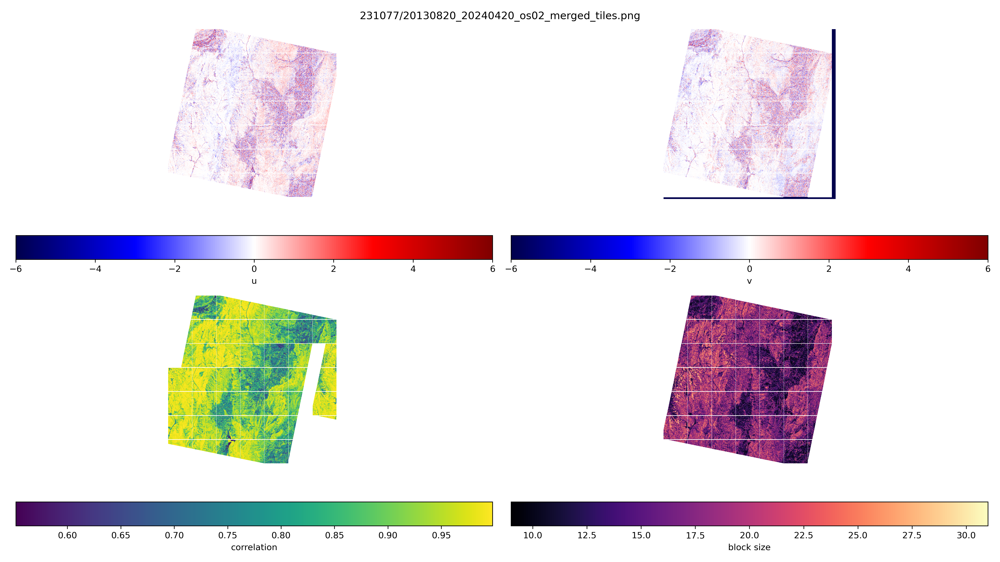

# Setup for running GPU-based block matching with tiles on a slurm queue

Requires the numba-based block matching code [https://github.com/UP-RS-ESP/numba_cuda_block_matching](https://github.com/UP-RS-ESP/numba_cuda_block_matching)

We require, conda, numba, and several other packages. These are included in the tensorflow environment. Start with `conda activate tensorflow`.

```bash

conda create -c conda-forge -n numba python=3.12 numpy numba ipython tqdm scipy matplotlib pandas gdal
conda activate numba
conda install nvidia::cuda-toolkit
```

Allocate a node in a cluster for interactive testing and starting jobs:
```bash
srun --partition=gpu --gres=gpu:2 --mem=128GB --nodelist=hgc02 --pty bash -i
```

Transfer with rsync and show combined progress:
```bash
rsync -az --info=progress2 bookhage@jlogin1.hpc.uni-potsdam.de:/work/bookhage/Landsat/P232R077/*.tif BLOCKMATCHING_os01_bs31_sr03/
```

0. **Data preparation**. You may want to resample your data before calculating the block matching. There is no automatic resampling included in the block matching algorithm. We expect the user to provide the input TIF in either the original resolution (Landsat = 15 m) or in an oversampled format. We suggest to use 3 (5 m), 5 (3 m), or 7 (1.5 m) times oversampling to keep the center pixel the same as the original resolution. We suggest to use _cubic_ resampling, for example via gdalwarp: gdalwarp -tr 5 5 -r cubic -co COMPRESS=DEFLATE -co ZLEVEL=7 LC08_L1TP_231077_20130820_20200913_02_T1_B8.TIF LC08_L1TP_231077_20130820_20200913_02_T1_B8_os03.TIF`. Run the oversampling step on the server where the data are stored.

    A bash script performing the oversampling for all files in a directory and writing the output to the *_os03:
    ```bash
    indir=CROP
    outdir=CROP_os03
    if [ ! -d $outdir ]; then
      mkdir $outdir
    fi

    for file in $indir/*_B8.TIF; do
      infile=$(basename "$file")
      outfile=$outdir/$infile
      if [ -f $outfile ]; then
        echo $outfile exists
      else
        echo "gdalwarp -tr 5 5 -r cubic -multi -srcnodata 0 -dstnodata 0 -co COMPRESS=DEFLATE -co ZLEVEL=7 $file $outfile"
        gdalwarp -tr 5 5 -r cubic -multi -srcnodata 0 -dstnodata 0 -co COMPRESS=DEFLATE -co ZLEVEL=7 $file $outfile
      fi
    done
    ```

    And for 5 times oversampling (3 m): 
    ```bash
    indir=CROP
    outdir=CROP_os05
    if [ ! -d $outdir ]; then
      mkdir $outdir
    fi

    for file in $indir/*_B8.TIF; do
      infile=$(basename "$file")
      outfile=$outdir/$infile
      if [ -f $outfile ]; then
        echo $outfile exists
      else
        echo "gdalwarp -tr 3 3 -r cubic -multi -srcnodata 0 -dstnodata 0 -co BIGTIFF=YES -co COMPRESS=DEFLATE -co ZLEVEL=7 $file $outfile"
        gdalwarp -tr 3 3 -r cubic -multi -srcnodata 0 -dstnodata 0 -co BIGTIFF=YES -co COMPRESS=DEFLATE -co ZLEVEL=7 $file $outfile
      fi
    done
    ```

1. **Generating tiles**. Run the initial tile generation on the server where the data are stored.
    ```bash
    mkdir log
    python create_Landsat_tiles.py /raid2-gpu2/bodo/Landsat-test 8192 64 1 2>&1 | tee log/create_Landsat_tiles_8192_64_1.log
    python create_Landsat_tiles.py /raid2-gpu2/bodo/Landsat-test/os03 4096 64 3 2>&1 | tee log/create_Landsat_tiles_4096_64_3.log
    python create_Landsat_tiles.py /raid2-gpu2/bodo/Landsat-test/os05 4096 64 5 2>&1 | tee log/create_Landsat_tiles_4096_64_5.log

    python create_Landsat_tiles.py /raid2-gpu2/bodo/LANDSAT/P232R077/CROP 8192 64 1 2>&1 | tee log/create_Landsat_tiles_P232R077_8192_64_1.log
    python create_Landsat_tiles.py /raid2-gpu2/bodo/LANDSAT/P232R077/CROP_os3 4096 64 3 2>&1 | tee log/create_Landsat_tiles_P232R077_4096_64_3.log
    python create_Landsat_tiles.py /raid2-gpu2/bodo/LANDSAT/P232R077/CROP_os5 4096 64 5 2>&1 | tee log/create_Landsat_tiles_P232R077_4096_64_3.log
    ```
    This will generate several tiles for oversampling factors of 1, 3, and 5. The overlap size will need to be adjusted according to the window (or kernel) size used for block matching. The tile size of 8192 has been found to work well with low oversampling factors. For higher oversampling rates (>3), a lower tile size may be necessary, because the window size will be larger. We suggest to use 4096. The detailed parameters for higher oversampling rates still have to be determined.
    The python-based code `create_Landsat_tiles.py` will convert all *.TIF files in a directory (argv[1]) into tiles. Padding will be done according to overlap and tile size. Standard naming scheme of USGS Earth Explorer Filenames is expected.

    An overview PNG of each tile (4x4 tiles on one page) is generated. Larger oversampling factors will generate several pages.


2. **Submitting tiles to the slurm queue.** Submit the tiles separately to each node in the cluster. This is best done through a `bash` script: 
    ```bash
    ./block_matching_slurm.bash /raid2-gpu2/bodo/Landsat-test/231077/ \
      /raid2-gpu2/bodo/Landsat-test/231077/20130820_os01 \
    /raid2-gpu2/bodo/Landsat-test/231077/20240420_os01 \
      8192 21 3 1 1
    ```
    The bash script will submit all tiles in argv[2] and argv[3] and run block matching with the given block size and search window. For original sizes Landsat images (overampling os01), a good block size is 21 and a search radius is 3 (allowing a maximum offset of 3 pixels or 45 m).

    A larger matching window size usually reduces noise:
    ```bash
    ./block_matching_slurm.bash /raid2-gpu2/bodo/Landsat-test/231077/ \
      /raid2-gpu2/bodo/Landsat-test/231077/20130820_os01 \
    /raid2-gpu2/bodo/Landsat-test/231077/20240420_os01 \
      8192 41 3 1 1
    ```
    
    A smaller matching window will run faster:
    ```bash
    ./block_matching_slurm.bash /raid2-gpu2/bodo/Landsat-test/231077/ \
      /raid2-gpu2/bodo/Landsat-test/231077/20130820_os01 \
    /raid2-gpu2/bodo/Landsat-test/231077/20240420_os01 \
      8192 11 3 1 1
    ```

    In the bash script, you will need to set the tool path where the python codes are stored (could be added as a command-line option). The maximum duration for one tile is set to 24 h (could be increased if required). A standard 2GB GPU memory will be reserved for each tile.

    For an oversampling rate of 3 (os03, 5 m for Landsat), a block size of 61 and search radius of 9 (about 3 Landsat pixels) is reasonable (the search radius can be further reduced to speed up processing).
    ```bash
    ./block_matching_slurm.bash /raid2-gpu2/bodo/Landsat-test/os03/231077/ \
      /raid2-gpu2/bodo/Landsat-test/os03/231077/20130820_os03 \
    /raid2-gpu2/bodo/Landsat-test/os03/231077/20240420_os03 \
      4096 61 9 3 1
    ```
    
    For an oversampling rate of 5 (os05, 3 m for Landsat), a block size of 61 and search radius of 10 (about 2 Landsat pixels) is reasonable (the search radius can be adjusted). In addition, we add a skip step of 5 - that is, only every 5th pixel is used as a correlation source. This reduces computation time and results in the same resolution as the original Landsat image.
    ```bash
    ./block_matching_slurm.bash /raid2-gpu2/bodo/Landsat-test/os03/231077/ \
      /raid2-gpu2/bodo/Landsat-test/os03/231077/20130820_os05 \
    /raid2-gpu2/bodo/Landsat-test/os03/231077/20240420_os05 \
      4096 61 10 5 5
    ```

3. **Merge tiles.** Collect tiles (untile) using the tile structure created in (1). Best to run this on the node where the data are stored. It requires the directory with the output for each tile of the block matching. Also, the tile size (argv[3]), oversampling factor (argv[4]), block size (argv[5]), search radius (argv[6]), and source geotiff file for obtaining projection information (argv[7]) will be passed on:
    ```bash
    python run_tile_merging.py 231077/20130820_20240420_os01 231077/20130820_os01 8192 1 21 3 LC08_L1TP_231077_20130820_20200913_02_T1_B8.TIF 2>&1 | tee log/run_tile_merging_8192_1_21_3.log
    python run_tile_merging.py 231077/20130820_20240420_os01 231077/20130820_os01 8192 1 41 3 LC08_L1TP_231077_20130820_20200913_02_T1_B8.TIF 2>&1 | tee log/run_tile_merging_8192_1_41_3.log

    ```



4. **Timing.** Additional tests are necessary to evaluate the block matching with varying parameters. This is just a first-order summary (os - oversampling, bs - block size, sr - search radius).

    Parameters | Tile size | Nr. of tiles | Timing for one tile (minutes)|
    ---|---|---|---|
    os01, bs21, sr05 | 8192 | 4 | 4.27 (Tesla V100, aconcagua), 17.37 (Tesla P40, kailash)
    os01, bs21, sr05 | 4096 | 16 | 1.08 (Tesla V100, aconcagua), 4.42 (Tesla P40, kailash), 9.71 (Quadro P4000, pcpool)
    os01, bs21, sr03 | 4096 | 16 | 0.44 (Tesla V100, aconcagua), 3.75 (Quadro P4000, pcpool), 1.66 (Quadro RTX 5000, pcpool), 2.44 (Quadro P5000, pcpool)
    os02, bs31, sr11 | 8192 | 16 | 58.88 (aconcagua), 238.63 (kailash), 549.32 (pc pool)
    os02, bs31, sr06 | 4096 | 49 | 4.90 (aconcagua), 21.28 (Tesla P40, kailash), 45.22 (Quadro P4000, pcpool) 18.73 (RTX 5000, pc pool), 11.56 (A40, sonnblick)
    os05, bs81, sr31 | 8192 | 80 | > 24 hours (not finished)
    os01, bs61, sr09 | full | 1 | 213.38 (H100, UP-HPC)
    os01, bs31, sr03 | full | 1 | 7 minutes (UP-HPC, 14941x15661 pixels)
    os01, bs31, sr03 | 10 x full | 1 | 60 minutes (H100, hgc01, UP-HPC, each job takes up 6 GB of GPU RAM)
    os03, bs61, sr06 | full | 1 | 994.95 minutes (16.5 h) (H100, hgc01, UP-HPC, 50GB of GPU RAM, 44823x46983 pixels) 
    os03, bs61, sr06 | full | 1 | 82.01 minutes with matching - step 03 (H100, hgc01, UP-HPC, 50GB of GPU RAM, 44823x46983 pixels) 
    os03, bs61, sr06 | full | 1 | 22.45 minutes with matching - step 06 (H100, hgc01, UP-HPC, 50GB of GPU RAM, 44823x46983 pixels) 


    **It looks like as if a full size Landsat scene with no oversampling (os=01) tiled into 4096x4096 pixels (16 tiles) and block size window 21 with a search radius of 3 or 5 pixels will run fast (~2 minutes for search radius 3 and 5 minutes for search radius 5). A full Landsat scene at original resolution with a block size of 61 (large) will run in 213 minutes on the UP-HPC.**

    **An oversampling factor of 2 with 49 tiles (4096x4096) and with a blocksize of 31 and a search radius of 06 (3 Landsat pixels) will take 19-45 minutes. 38 jobs can be submitted at once. After less than 1 hour, the entire Landsat tile has been processed.**

    Higher oversampling factors will be much slower and a skip step approach is required.

5. **Steps to do**
  - use a skip-step factor for calculating block matching for high oversampling rates
  - Combine different oversampling rates
  - optimize stacking
  - create geotiffs from overampled data (need new geotransform)
  - optimize tile merging (there is still a blank pixel in between)


# We can also run the full tile on the large NVIDIA H100 on the HPC cluster

1. Copy data to HPC.
    ```bash
    rsync -avz CROP corr_dates* bookhage@jlogin1.hpc.uni-potsdam.de:/work/bookhage/Landsat/P001R077
    rsync -avz CROP_os05 bookhage@jlogin1.hpc.uni-potsdam.de:/work/bookhage/Landsat/P001R077
    ```

    Copy Code to HPC:
    ```bash
    rsync -avz /home/bodo/Dropbox/soft/github/slurm_blockmatching bookhage@jlogin1.hpc.uni-potsdam.de:/work/bookhage/Landsat/code
    ```


2. Create job files to run on gpu node. There are two H100 attached to each node - submit to both nodes with shell script. This will create several bash files to be submitted to the slurm queue. 
    ```bash
    export PYTHONPATH="${PYTHONPATH}:/work/bookhage/Landsat/code"
    cd /work/bookhage/Landsat/P001R077/
    mkdir log
    python /work/bookhage/Landsat/code/slurm_blockmatching/create_runfile_fullscene_blockmatching.py \
      /work/bookhage/Landsat/P001R077/corr_dates_sd1_cc23 \
      /work/bookhage/Landsat/P001R077/run_block_matching_001077_os01_bs31_sr03_ms01.bash \
      001077 31 3 1 1 10
    ```

    Creating a job with a matching step size of 15 for an oversampling of 3:
    ```bash
    export PYTHONPATH="${PYTHONPATH}:/work/bookhage/Landsat/code"
    cd /work/bookhage/Landsat/P232R077/
    mkdir log
    python /work/bookhage/Landsat/code/slurm_blockmatching/create_runfile_fullscene_blockmatching.py \
      /work/bookhage/Landsat/P232R077/corr_dates_sd1_cc5 \
      /work/bookhage/Landsat/P232R077/run_block_matching_232077_os03_bs61_sr10_ms15.bash \
      232077 61 10 3 15 1
    ```

3. Submit jobs with sbatch:
    ```bash
    cd /work/bookhage/Landsat/P232R077/
    . ./sbatch.run.bash
    #or separately:
    sbatch /work/bookhage/Landsat/P232R077/run_block_matching_232077_os03_bs61_sr10_ms15_job000.bash
    sbatch /work/bookhage/Landsat/P232R077/run_block_matching_232077_os03_bs61_sr10_ms15_job001.bash
    ```
